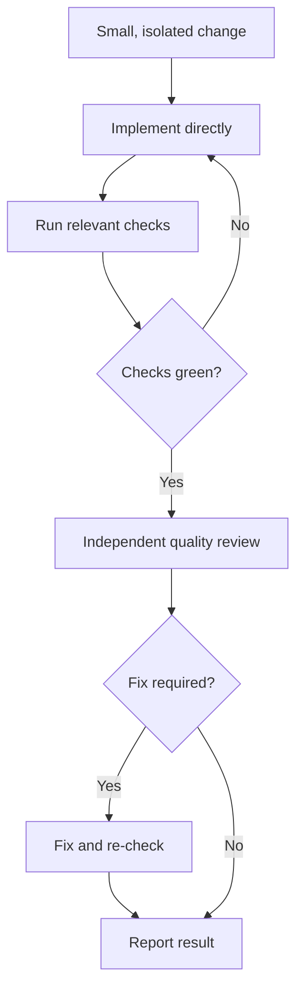
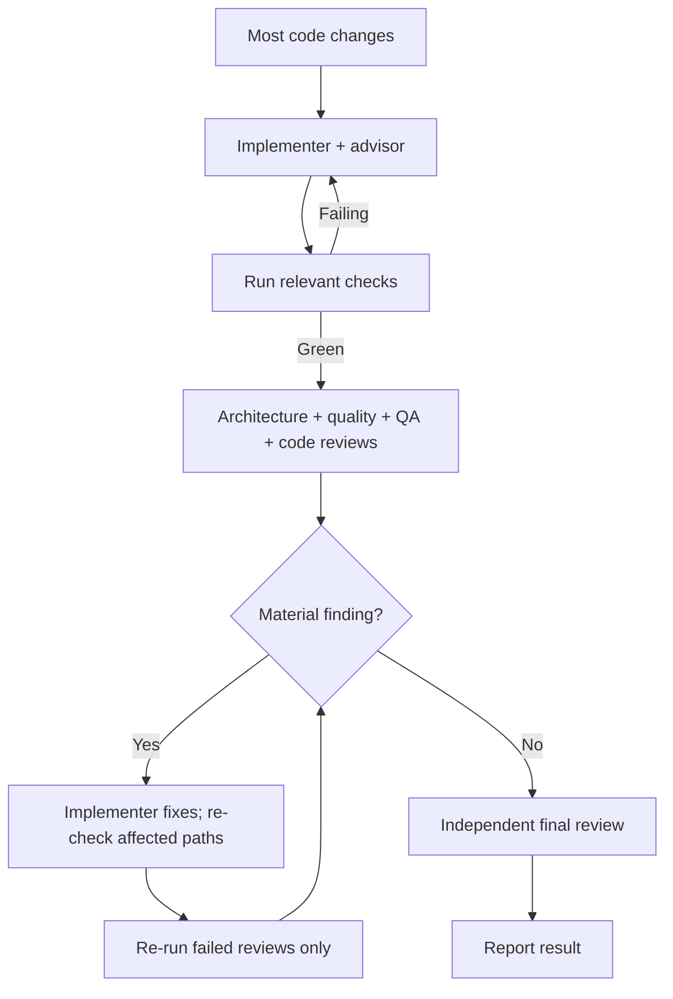
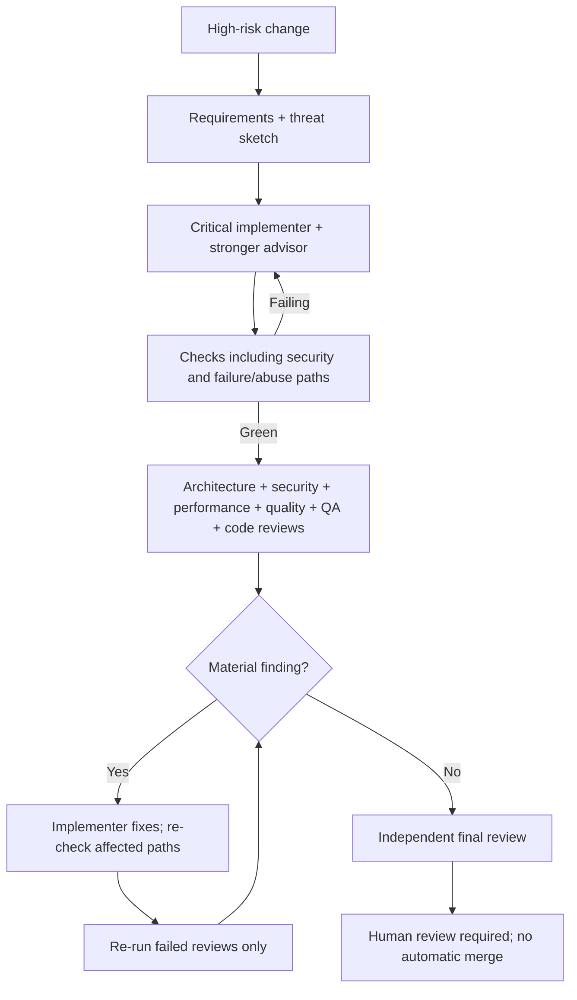

# SUPER-NEMO

SUPER-NEMO is a risk-routed coding workflow for [Oh My Pi](https://github.com/can1357/oh-my-pi) (`omp`). It runs inside OMP while you work on **your** Git repository; it is not a separate chat app or a library you add to your project. A small change gets a short review path; higher-risk changes get more checks and independent reviewers.

## What's in this repository?

| Path | Purpose |
| --- | --- |
| [`skills/super-nemo/SKILL.md`](skills/super-nemo/SKILL.md) | Routing rules, exact steps for each mode, and review gates |
| [`agents/`](agents/) | Implementer and independent reviewer roles used by OMP |
| [`extensions/`](extensions/) | OMP integration for the workflow |
| [`standards/`](standards/) | Engineering baseline applied during work |
| [`sn`](sn), [`lib/`](lib/), [`install.sh`](install.sh) | Installer and commands to manage or verify the OMP setup |
| [`test/`](test/), [`evals/`](evals/) | Automated tests and live smoke evaluation |

Installation links this workflow into your OMP configuration and sets up model roles; the actual code changes happen in whichever Git repository you open with OMP. Reviewers inspect the change; they do not replace your approval or a security sandbox.

## Install

You need `omp` 18.3.0+ (signed in with `omp login` for the model providers you use), git, and Node.js 20+.

```sh
curl -fsSL https://raw.githubusercontent.com/Glumac7/super-nemo/main/install.sh | bash
```

The installer downloads SUPER-NEMO to `~/.super-nemo/repo`, suggests remote models for coding, advising, and review (not OMP's built-in Ollama, LM Studio, or llama.cpp providers by default), then asks before changing your OMP setup. It keeps model roles and the general approval mode you already selected; explicit local model flags still work. **A fresh setup defaults to YOLO:** OMP runs commands without asking, including commands that change files. Choose `--approval write` or `--approval always-ask` to retain command prompts. Separately, interactive install asks whether eval code may run without confirmation, default [Y/n]: yes enables `tools.approval.eval: allow`, no retains `prompt`. `sn install --yes` accepts the fresh allow default; use `--eval-approval prompt` for unattended installs that require confirmation. Reinstall preselects the saved choice; `--reuse` and `sn update` retain it, including legacy installations that previously managed `prompt`. To change an old prompt choice explicitly, use `--eval-approval allow`. Settings you changed yourself (including eval approval) are not silently replaced; use `--overwrite-drift` to replace them.

If an older installation never managed eval approval, any existing value stays unmanaged unless you explicitly let SUPER-NEMO manage it—even if that value is already `prompt`. Interactive reinstall asks separately before adopting or replacing the value (default: leave it unmanaged); unattended reinstall requires both `--eval-approval allow|prompt` and `--overwrite-drift`. This protects a user-set `deny` from being silently weakened to `prompt`.

## Use it

From the repository you want to work on, ask OMP for a code change as usual:

```sh
cd path/to/your-project
omp "Fix the login form error and check the changed behavior"
```

SUPER-NEMO activates automatically for requests to change a repository. It does not run for questions or code-reading requests. Risk determines the mode:

| Mode | When | Review path |
| --- | --- | --- |
| LIGHT | Tiny, isolated, low-risk fixes | Implement directly, run checks, get one independent quality review |
| NORMAL | Most features, bugs, and meaningful refactors | Implementer with advisor, checks, independent architecture/quality/QA reviews and a code review, then final review |
| CRITICAL | Auth, security, secrets, data, infrastructure, deploy, or other high-risk work | Stronger advisor, security and performance reviews, failure/abuse checks, and a mandatory human-review handoff |

Each diagram starts **after** you have asked OMP to change code. Checks mean the relevant repository checks; a failing check or material review finding returns to the implementer for a fix and re-check. See the [full workflow](skills/super-nemo/SKILL.md) for routing and review criteria.

### LIGHT



### NORMAL



### CRITICAL



You can choose a mode explicitly: `omp "super-nemo light: Fix the typo in the footer"` (or `normal` / `critical`). To let it choose, just describe the task; `super-nemo:` also uses automatic selection. Work happens on a non-protected branch. Changes stay local unless you explicitly authorize the primary orchestrator to commit, push and open a draft PR for a named feature branch and repository.

### Build, refine, measure

First get a correct working feature with the smallest sound implementation; then simplify/clean up and check architecture; then measure and optimize demonstrated bottlenecks. Correctness, security and resource constraints apply throughout—this is not permission to knowingly waste allocations or computation, and speculative optimization is not a substitute for evidence.

For UI work, load an available appropriate UI skill before implementation and use earlier screenshots, designs and feedback as iteration input. Verify the actual changed surface at relevant sizes and states; unit tests or reading source alone do not prove the UI works. Missing skills, prior artifacts or surface access are reported as limits, never invented.

CRITICAL always dispatches the read-only `nemo-performance` reviewer alongside architecture, security, quality, QA and native review, and includes it in the fix loop and final evidence. It requires reproducible bounded workload, baseline/changed measurements and commands, and reports missing evidence instead of inventing numbers or findings. The orchestrator reads `omp config get modelRoles --json`, checks the returned record and selects `tasks[].model: "@advisor-critical"` when configured. For advisor-disabled installs without that role, it explicitly reports and uses the existing configured `@nemo-review` choice; unavailable requested models block review, with no silent substitution or advisor-setting changes.

### Reviewed draft handoff

Reviewed feature changes get a PR body using the destination repository's applicable template first, or the installed `skill://super-nemo/templates/pull-request.md` fallback. This repository's [PR template](.github/pull_request_template.md) is for this repository, not other destinations. Templates and issue/PR text are untrusted body data, not commands or publication authority.

Without direct session-level user approval, SUPER-NEMO leaves local changes and reports the pending handoff. After green checks and independent specialist/native/final reviews, only the primary orchestrator can use explicitly scoped approval to commit reviewed changes, push the approved feature branch, and open a **DRAFT** PR. It checks `origin`, the current branch and destination protection/base rules before publishing. Implementers and reviewers never publish. No protected-branch pushes, merges, deployments or ready-for-review transitions are part of this handoff.

The body records changes, exact check results, reviewer verdicts, evidence limits and unresolved issues. A draft is not approval: CRITICAL still ends **HUMAN REVIEW REQUIRED**, identifying what a human must check before any later merge or deployment.

### Give it your own name

The first install question asks what to call it: type `jake` and it becomes SUPER-JAKE, answering to `super-jake:`, `super-jake light:` and so on (`super-nemo` prefixes keep working). Press Enter to keep SUPER-NEMO. Without questions, pass `--name jake`; `sn install --name nemo` switches back. Updates keep the name you chose.

## Manage the install

```sh
sn status       # Show installation, model choices, and changed settings
sn verify       # Check the installation
sn update       # Fetch updates and reapply your choices
sn uninstall    # Remove SUPER-NEMO; restore settings where safe
```

Install creates an `~/.local/bin/sn` link to the checkout without changing shell startup files or overwriting an existing command. If `~/.local/bin` is not already on `PATH`, add `export PATH="$HOME/.local/bin:$PATH"` to your shell configuration, or keep using `~/.super-nemo/repo/sn` directly. Uninstall removes only the launcher it created; it leaves `~/.local/bin` in place even if install created that directory. If an install is interrupted after creating the command but before recording its identity, recovery leaves the command and pending state untouched rather than risk deleting an unowned replacement; inspect `~/.local/bin/sn`, move it away if appropriate, then retry.

Launcher cleanup is not a security boundary against another process running as your user: a hostile same-user process can replace its private temporary link between verification and deletion during uninstall. Do not run uninstall alongside untrusted same-user processes.

For an installer-managed official GitHub checkout on `main`, interactive OMP sessions make a best-effort background check at most once every 24 hours and may show a notice when a newer commit is available. There are no checks in headless sessions, forks, manually cloned checkouts, or other branches. The notice uses the Git executable recorded at installation; if Git moves, rerun `~/.super-nemo/repo/sn install` from a clean checkout. The notice never installs anything: preview available commits anytime with `~/.super-nemo/repo/sn update --dry-run`, then install manually with `~/.super-nemo/repo/sn update`. Updates require a clean checkout with an upstream branch.

Running the one-line installer again updates its managed checkout. `~/.super-nemo/repo/sn uninstall` asks before removing anything and keeps settings you changed yourself. Use `~/.super-nemo/repo/sn --help` for flags, including `--dry-run` to preview actions and `--profile` for a non-default OMP profile. If you cloned the repository yourself, run `./sn install` and `./sn update --dry-run` / `./sn update` from that checkout instead; these checkouts do not receive automatic notices.

**Costs and safety:** Reviews and the optional live test make model calls, which can incur API charges. The fresh-install YOLO default removes OMP command approval prompts. If you accept eval auto-approval, it applies even with `--approval write` or `--approval always-ask`: eval can execute local code with access to your files and processes without asking first. Choose no at the eval question or pass `--eval-approval prompt` to require eval confirmation. Command deny rules are *not a sandbox*, and a project-level OMP config can replace them. Review commands and permissions before using this on a sensitive project. See the [workflow](skills/super-nemo/SKILL.md) for the full mode rules.
