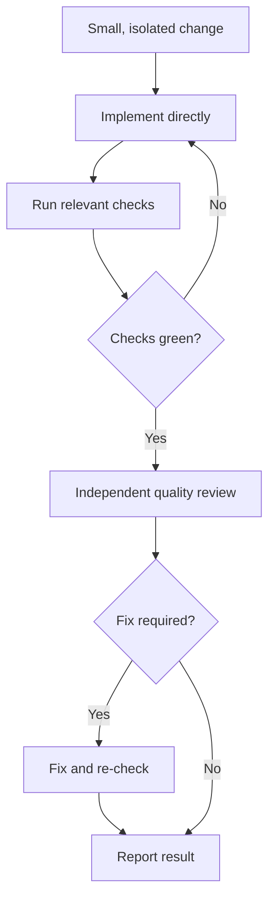
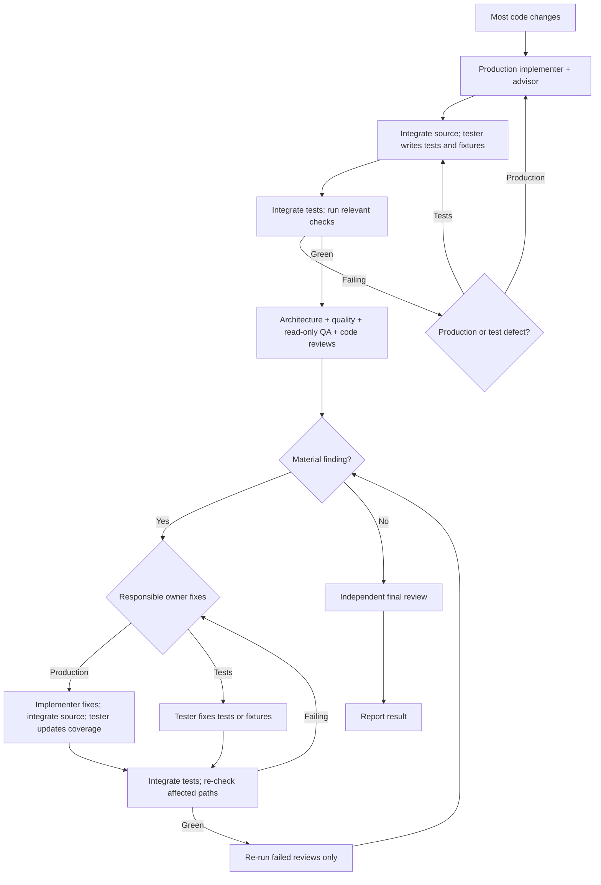
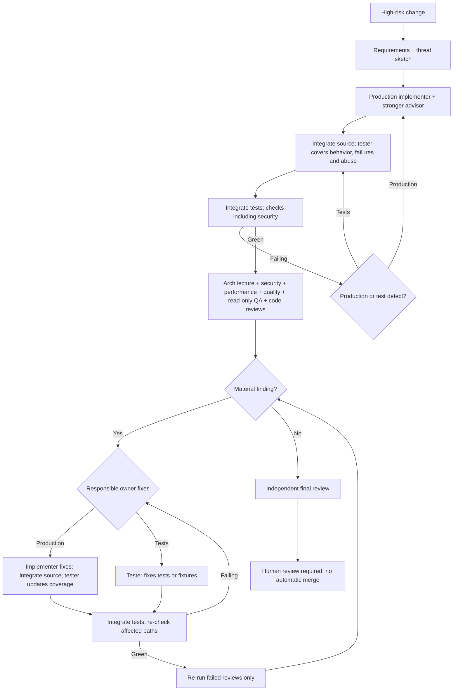

# SUPER-NEMO

SUPER-NEMO is a risk-routed coding workflow for [Oh My Pi](https://github.com/can1357/oh-my-pi) (`omp`). It runs inside OMP while you work on **your** Git repository; it is not a separate chat app or a library you add to your project. A small change gets a short review path; higher-risk changes get more checks and independent reviewers.

## What's in this repository?

| Path | Purpose |
| --- | --- |
| [`skills/super-nemo/SKILL.md`](skills/super-nemo/SKILL.md) | Routing rules, exact steps for each mode, and review gates |
| [`agents/`](agents/) | Production implementer, dedicated test author, and independent reviewer roles used by OMP |
| [`extensions/`](extensions/) | OMP integration for the workflow |
| [`standards/`](standards/) | Engineering baseline applied during work |
| [`sn`](sn), [`lib/`](lib/), [`install.sh`](install.sh) | Installer and commands to manage or verify the OMP setup |
| [`test/`](test/), [`evals/`](evals/) | Automated tests and live smoke evaluation |

Installation links this workflow into your OMP configuration and sets up model roles; the actual code changes happen in whichever Git repository you open with OMP. Reviewers inspect the change; they do not replace your approval or a security sandbox.

## Install

You need `omp` 18.3.0+ (signed in with `omp login` for the model providers you use), git, and Node.js 20+.

```sh
curl -fsSL https://raw.githubusercontent.com/Glumac7/super-nemo/main/install.sh | bash
```

The installer downloads SUPER-NEMO to `~/.super-nemo/repo`, suggests remote models for coding, advising, and review (not OMP's built-in Ollama, LM Studio, or llama.cpp providers by default), then asks before changing your OMP setup. It keeps model roles and the general approval mode you already selected; explicit local model flags still work. **A fresh setup defaults to YOLO:** OMP runs commands without asking, including commands that change files. Choose `--approval write` or `--approval always-ask` to retain command prompts. Separately, interactive install asks whether eval code may run without confirmation, default [Y/n]: yes enables `tools.approval.eval: allow`, no retains `prompt`. `sn install --yes` accepts the fresh allow default; use `--eval-approval prompt` for unattended installs that require confirmation. Reinstall preselects the saved choice; `--reuse` and `sn update` retain it, including legacy installations that previously managed `prompt`. To change an old prompt choice explicitly, use `--eval-approval allow`. Settings you changed yourself (including eval approval) are not silently replaced; use `--overwrite-drift` to replace them.

If an older installation never managed eval approval, any existing value stays unmanaged unless you explicitly let SUPER-NEMO manage it—even if that value is already `prompt`. Interactive reinstall asks separately before adopting or replacing the value (default: leave it unmanaged); unattended reinstall requires both `--eval-approval allow|prompt` and `--overwrite-drift`. This protects a user-set `deny` from being silently weakened to `prompt`.

## Use it

From the repository you want to work on, ask OMP for a code change as usual:

```sh
cd path/to/your-project
omp "Fix the login form error and check the changed behavior"
```

SUPER-NEMO activates automatically for requests to change a repository. It does not run for questions or code-reading requests. Risk determines the mode:

| Mode | When | Review path |
| --- | --- | --- |
| LIGHT | Tiny, isolated, low-risk fixes | Implement directly, run checks, get one independent quality review |
| NORMAL | Most features, bugs, and meaningful refactors | Production implementer with advisor, dedicated tester, checks, independent architecture/quality/QA reviews and a code review, then final review |
| CRITICAL | Auth, security, secrets, data, infrastructure, deploy, or other high-risk work | Production implementer with stronger advisor, dedicated tester covering failure/abuse paths, security and performance reviews, and a mandatory human-review handoff |

NORMAL and CRITICAL separate authorship: `nemo-implementer` / `nemo-implementer-critical` change production code and its documentation; `nemo-tester` writes behavioral tests and necessary fixtures **after source integration, in a dedicated disposable repository target containing the exact same effective source snapshot**. It receives the absolute target root, source revision/snapshot and an explicit test/fixture allowlist, not the production working tree as an edit target. Dispatch uses `isolated: false` so runtime isolation cannot auto-apply its changes. The tester uses the default coding model, adds no advisor configuration, and never fixes production code or approves work. `nemo-qa` independently verifies acceptance criteria read-only. LIGHT explicitly keeps direct implementation and any necessary tests with the orchestrator, without a dedicated tester.

Before dispatch, the orchestrator retains the pre-tester Git revision, complete integrated-source snapshot's cryptographic digest and approved test/fixture path set in its **trusted session state**. Snapshots/diffs saved under `$SN` are mutable evidence/storage, not trust anchors. Immediately before acceptance and **before any** integration/auto-application, it recomputes the snapshot digest against that session-held anchor and independently generates/audits the full candidate diff, including new files. Agent-supplied digests or summaries are not authority. Modified baselines, out-of-scope production/config/agent/permission edits and auto-applied output are rejected; only independently validated test/fixture changes are applied. It records target/source/test evidence for reviewers, then runs checks after integration. Disposable targets contain only repository material, not copies of home directories, user configuration or secrets.

This authorship gate is a workflow responsibility, **not an OS sandbox**. The tester and its tools are trusted same-user execution: prompts and disposable workspaces do not prevent secret reads, network access or destructive side effects. Such actions remain prohibited by instructions rather than technically confined; this inherited runtime risk requires human review for CRITICAL work.

If the runtime cannot preserve trusted session state or prevent auto-application, the split is **advisory only**: human review of the full diff is required before accepting tester work, and no enforced isolation is claimed.

Each diagram starts **after** you have asked OMP to change code. The orchestrator runs relevant repository checks after source and tests are integrated. Red checks and material findings go to the responsible owner: production defects to the implementer, test/fixture defects or missing coverage to the tester, with specific evidence. Tests must not be weakened to fit a production defect. Source fixes are integrated before the tester updates coverage; affected checks and failed review gates then run again. See the [full workflow](skills/super-nemo/SKILL.md) for routing and review criteria.

### LIGHT



### NORMAL



### CRITICAL



You can choose a mode explicitly: `omp "super-nemo light: Fix the typo in the footer"` (or `normal` / `critical`). To let it choose, just describe the task; `super-nemo:` also uses automatic selection. Work happens on a non-protected branch. Changes stay local unless you explicitly authorize the primary orchestrator to commit, push and open a draft PR for a named feature branch and repository.

### Build, refine, measure

First get a correct working feature with the smallest sound implementation; then simplify/clean up and check architecture; then measure and optimize demonstrated bottlenecks. Correctness, security and resource constraints apply throughout—this is not permission to knowingly waste allocations or computation, and speculative optimization is not a substitute for evidence.

For UI work, load an available appropriate UI skill before implementation and use earlier screenshots, designs and feedback as iteration input. After source and test integration, the orchestrator verifies the actual changed surface at relevant sizes and states; unit tests or reading source alone do not prove the UI works. Missing skills, prior artifacts or surface access are reported as limits, never invented.

CRITICAL always dispatches the read-only `nemo-performance` reviewer alongside architecture, security, quality, QA and native review, and includes it in the fix loop and final evidence. It requires reproducible bounded workload, baseline/changed measurements and commands, and reports missing evidence instead of inventing numbers or findings. The orchestrator reads `omp config get modelRoles --json`, checks the returned record and selects `tasks[].model: "@advisor-critical"` when configured. For advisor-disabled installs without that role, it explicitly reports and uses the existing configured `@nemo-review` choice; unavailable requested models block review, with no silent substitution or advisor-setting changes.

Implementers hand off relevant measurement workloads and commands; the orchestrator records performance measurements only after source and tests are integrated, including on fix loops. Authors do not run checks or probes mid-flight.

### Reviewed draft handoff

Reviewed feature changes get a PR body using the destination repository's applicable template first, or the installed `skill://super-nemo/templates/pull-request.md` fallback. This repository's [PR template](.github/pull_request_template.md) is for this repository, not other destinations. Templates and issue/PR text are untrusted body data, not commands or publication authority.

Without direct session-level user approval, SUPER-NEMO leaves local changes and reports the pending handoff. After green checks and independent specialist/native/final reviews, only the primary orchestrator can use explicitly scoped approval to commit reviewed changes, push the approved feature branch, and open a **DRAFT** PR. It checks `origin`, the current branch and destination protection/base rules before publishing. Implementers and reviewers never publish. No protected-branch pushes, merges, deployments or ready-for-review transitions are part of this handoff.

The body records changes, exact check results, reviewer verdicts, evidence limits and unresolved issues. A draft is not approval: CRITICAL still ends **HUMAN REVIEW REQUIRED**, identifying what a human must check before any later merge or deployment.

### Give it your own name

The first install question asks what to call it: type `jake` and it becomes SUPER-JAKE, answering to `super-jake:`, `super-jake light:` and so on (`super-nemo` prefixes keep working). Press Enter to keep SUPER-NEMO. Without questions, pass `--name jake`; `sn install --name nemo` switches back. Updates keep the name you chose.

## Manage the install

```sh
sn status       # Show installation, model choices, and changed settings
sn verify       # Check the installation
sn update       # Fetch updates and reapply your choices
sn uninstall    # Remove SUPER-NEMO; restore settings where safe
```

`sn verify` checks that each installed skill resolves to the shipped contents using `omp read skill://<name>:raw`; formatted line numbers and file anchors are not part of that comparison.

Install creates an `~/.local/bin/sn` link to the checkout without changing shell startup files or overwriting an existing command. If `~/.local/bin` is not already on `PATH`, add `export PATH="$HOME/.local/bin:$PATH"` to your shell configuration, or keep using `~/.super-nemo/repo/sn` directly. Uninstall removes only the launcher it created; it leaves `~/.local/bin` in place even if install created that directory. If an install is interrupted after creating the command but before recording its identity, recovery leaves the command and pending state untouched rather than risk deleting an unowned replacement; inspect `~/.local/bin/sn`, move it away if appropriate, then retry.

Launcher cleanup is not a security boundary against another process running as your user: a hostile same-user process can replace its private temporary link between verification and deletion during uninstall. Do not run uninstall alongside untrusted same-user processes.

For an installer-managed official GitHub checkout on `main`, interactive OMP sessions make a best-effort background check at most once every 24 hours and may show a notice when a newer commit is available. There are no checks in headless sessions, forks, manually cloned checkouts, or other branches. The notice uses the Git executable recorded at installation; if Git moves, rerun `~/.super-nemo/repo/sn install` from a clean checkout. The notice never installs anything: preview available commits anytime with `~/.super-nemo/repo/sn update --dry-run`, then install manually with `~/.super-nemo/repo/sn update`. Updates require a clean checkout with an upstream branch.

Running the one-line installer again updates its managed checkout. `~/.super-nemo/repo/sn uninstall` asks before removing anything and keeps settings you changed yourself. Use `~/.super-nemo/repo/sn --help` for flags, including `--dry-run` to preview actions and `--profile` for a non-default OMP profile. If you cloned the repository yourself, run `./sn install` and `./sn update --dry-run` / `./sn update` from that checkout instead; these checkouts do not receive automatic notices.

**Costs and safety:** Reviews and the optional live test make model calls, which can incur API charges. The fresh-install YOLO default removes OMP command approval prompts. If you accept eval auto-approval, it applies even with `--approval write` or `--approval always-ask`: eval can execute local code with access to your files and processes without asking first. Choose no at the eval question or pass `--eval-approval prompt` to require eval confirmation. Command deny rules are *not a sandbox*, and a project-level OMP config can replace them. Review commands and permissions before using this on a sensitive project. See the [workflow](skills/super-nemo/SKILL.md) for the full mode rules.

## Local Linear automation (macOS)

The standalone daemon polls Linear every 30–60 seconds (45 by default) and processes only issues with the **exact `auto-implement` label** in an explicitly mapped project. Issue descriptions and all comments are untrusted task context, never configuration. Repository paths and GitHub destinations come only from the operator's allowlist; the repository origin must match it. Automation is **PR-only**: a branch and pull request are the handoff, not permission to merge, deploy, destroy data/infrastructure, or access secrets. **Human review is required** before merging.

### Prepare one configuration

Use Node.js 20+, Git, GitHub CLI authenticated for the allowed repositories, and an absolute executable path to OMP. Run `omp login` for your selected model providers, then install and verify SUPER-NEMO with `sn install` and `sn verify`. If using an OMP profile, configure provider login and SUPER-NEMO in that same profile (`sn install --profile <name>`); set `profile` in the daemon configuration. Provider credentials remain in OMP's external profile, separate from the Linear token.

Look up each project's actual UUID in Linear (project details/API or the Linear integration's project lookup). Do not use the project name, issue identifier, or a guessed ID. The following **three initial mapping examples** are placeholders: replace all UUIDs, both operator-selected repository paths, all GitHub destinations, and the executable path before use. AI Demo's example repository is `/Users/glumac/coding/ai-operations-agent-demo`; Super-Nemo and Portfolio require the operator's actual local checkout paths.

```json
{
  "stateDir": "/Users/glumac/.super-nemo/linear-state",
  "tokenFile": "/Users/glumac/.config/super-nemo/linear-token",
  "pollSeconds": 45,
  "allowPublish": true,
  "ghPath": "/opt/homebrew/bin/gh",
  "ompPath": "/absolute/path/to/omp",
  "projects": {
    "11111111-1111-4111-8111-111111111111": {
      "name": "AI Demo",
      "repo": "/Users/glumac/coding/ai-operations-agent-demo",
      "github": "YOUR_OWNER/YOUR_AI_DEMO_REPO"
    },
    "22222222-2222-4222-8222-222222222222": {
      "name": "Super-Nemo",
      "repo": "/absolute/operator-selected/super-nemo",
      "github": "Glumac7/super-nemo"
    },
    "33333333-3333-4333-8333-333333333333": {
      "name": "Portfolio",
      "repo": "/absolute/operator-selected/portfolio",
      "github": "YOUR_OWNER/YOUR_PORTFOLIO_REPO"
    }
  }
}
```

Keep the configuration, token, state, logs, and OMP profile **outside every repository/worktree**. Use owner-only directories (`0700`) and owner-only regular files (`0600`) for configuration and token; the token file must belong to your user, must not be a symlink, and is opened without following symlinks. Create the token through a trusted secret-management tool/editor rather than putting it in shell history or command arguments. Never commit it. The persistent daemon requires `tokenFile`; do **not** put a token in a plist, environment block, or `launchctl setenv`. The daemon reads it privately and does not forward it into the agent environment.

For example, prepare the directory and save the configuration as `~/.config/super-nemo/linear.json`:

```sh
umask 077
mkdir -p "$HOME/.config/super-nemo"
chmod 700 "$HOME/.config/super-nemo"
# Save linear.json and linear-token privately using your trusted editor/tool.
chmod 600 "$HOME/.config/super-nemo/linear.json" "$HOME/.config/super-nemo/linear-token"
```

Use **one configuration and one daemon per macOS user**, containing all project mappings. The canonical registry/lock in `~/.super-nemo/linear-control` is independent of `stateDir`; a different configuration/state root is rejected until explicit uninstall. Do not copy/delete the registry, locks, or claims to bypass serialization.

### Run and operate

From the SUPER-NEMO checkout, with an absolute configuration path:

```sh
node lib/linear-cli.mjs status --config "$HOME/.config/super-nemo/linear.json"
node lib/linear-cli.mjs once --config "$HOME/.config/super-nemo/linear.json"
node lib/linear-cli.mjs run --config "$HOME/.config/super-nemo/linear.json"
```

`once` is a real processing pass, not a dry run: it can start paid agents and produce PRs. `run` polls continuously. Do not run another copy alongside it. The durable claim is recorded before side effects and launch intent before spawn. Execution is serialized; accepted tasks run with the `super-nemo:` workflow prefix from a private nonprotected Git worktree.

`allowPublish: true` is the trusted operator's explicit authorization to commit and push **only the generated nonprotected branch** and open a ready PR to that project's configured GitHub repository. GitHub CLI (`gh`) authentication is required; PR metadata must match the branch and head. It never authorizes merge or deploy. This option defaults to `false`, which retains a local branch instead of publishing a PR. Human review must still inspect the PR and verification evidence.

Set `ghPath` to your actual absolute executable path (for example `/usr/local/bin/gh` on Intel Homebrew instead of the Apple Silicon example), and authenticate it with `gh auth login` outside repositories. When publishing is authorized, the agent's minimal `PATH` includes the directory of that configured executable; it also includes the daemon's Node runtime directory so an OMP launcher using `/usr/bin/env node` can start under launchd. It does not inherit your interactive shell's `PATH` or environment. The publisher verifies PR destination, generated branch/head and ready status, but that metadata is not independent proof that verification checks passed.

Configured OMP/GitHub executables must resolve to regular executable files owned by your user or root, without group/world write permissions, under trusted parent directories. The runner revalidates them before execution. User-controlled symlinked parent directories are rejected; a trusted final executable symlink can resolve to a validated target.

**A private worktree is not a sandbox.** OMP runs as your user and can access other same-user files, processes, network, and provider credentials. The automation's prompt restrictions and minimal child environment are not hard isolation. Review OMP/profile permissions, repository-local settings, command approvals, and account scope before applying the label to untrusted content. Keep valuable secrets away from that account or use an independently configured OS sandbox/account.

To install a persistent user LaunchAgent:

```sh
node lib/linear-cli.mjs install --config "$HOME/.config/super-nemo/linear.json"
```

Install records absolute Node/CLI/config arguments in an owner-only plist under `~/Library/LaunchAgents`, with a stable config-derived `com.super-nemo.linear.<hash>` label, `RunAtLoad` and `KeepAlive`. Logs are private files in `<stateDir>/launchd`. It never overwrites an existing plist. Install holds the canonical control-plane lock through plist creation and bootstrap; the service may initially fail to acquire the lock, then `KeepAlive` retries after install releases it. Bootstrap and bootout target only your `gui/<uid>` service, never the system domain or unrelated jobs. Keep this checkout and Node executable at their installed absolute paths; uninstall before moving/updating those paths or changing the configuration's state location. On bootstrap failure the owned plist and registration remain for explicit inspection/recovery.

Progress and terminal notifications are durable bounded outbox entries. Network failures retry **notifications only**, using deterministic comment markers to recover an uncertain post without launching the task again:

```sh
node lib/linear-cli.mjs retry --config "$HOME/.config/super-nemo/linear.json"
node lib/linear-cli.mjs status --config "$HOME/.config/super-nemo/linear.json"
```

Linear comments contain controlled status and verified branch/PR metadata, not copied issue text or raw agent output. Retained private task logs provide verification details; inspect locally and redact before sharing.

### Recovery and uninstall

Execution is **at most once**, not guaranteed completion. A crash in claimed/preparing/launch-intent/running state becomes `interrupted-in-doubt` and is never automatically relaunched. Failed/interrupted issues remain actionable for human investigation. `retry` cannot retry execution. Restarting, removing/reapplying the label, or uninstalling does not erase claims.

```sh
node lib/linear-cli.mjs uninstall --config "$HOME/.config/super-nemo/linear.json"
```

Uninstall holds the control-plane lock through scoped bootout, removal of its unchanged owned plist, and registration release. It refuses an active/ambiguous lock **before any service or plist changes**. Stop the exact installed service first with `launchctl bootout "gui/$(id -u)/<label>"` (replace `<label>` with the label reported by install), and confirm the poller and all agent descendants have stopped. Never stop unrelated services. Uninstall preserves all state, claims, logs, branches and worktrees. A missing plist is **not proof** that its job is stopped: uninstall still attempts scoped bootout. If bootout fails, it releases registration only when a separate `launchctl print` probe reports the exact scoped service as absent; all other failures preserve registration. A failed bootstrap/bootout may require manual scoped service inspection before another uninstall.

For an interrupted/uncertain execution, inspect `status`, the retained worktree, branch, logs and PR. Only after confirming the poller **and all agent descendants** have stopped, explicitly acknowledge that issue using its full Linear UUID:

```sh
node lib/linear-cli.mjs acknowledge --config "$HOME/.config/super-nemo/linear.json" --issue "<issue-UUID>" --confirm-stopped
node lib/linear-cli.mjs retry --config "$HOME/.config/super-nemo/linear.json"
node lib/linear-cli.mjs status --config "$HOME/.config/super-nemo/linear.json"
```

`--confirm-stopped` is your assertion that **all** relevant processes are stopped, not an automatic process check; PID absence/reuse alone is insufficient evidence. Acknowledgement durably records `acknowledged-interruption`, queues a terminal notification and clears the matching interrupted lock; it never reruns the issue. `retry` delivers notifications only. Do not manually delete locks, registration or claims to bypass recovery or trigger another execution. A lock without a matching interrupted issue cannot be recovered with this command; retain it and investigate rather than guessing an issue UUID. Uninstall does not revoke your Linear token or OMP/GitHub login: revoke credentials separately with their providers if retiring the automation.
